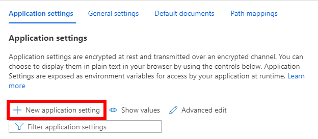

# Azure Dev Day - Web Apps with App Service

<!-- TOC -->
**Overview**: 

- [Requirements](#requirements)
- [Step 1: Create a Web App in the Azure portal](#step-1-create-a-web-app-in-the-azure-portal)
- [Step 2: Deploy Github application ](#step-2-deploy-github-application)
- [Step 3: Setup application configuration](#step-3-setup-application-configuration)
- [Step 4: Setup auto-scale](#step-4-setup-auto-scale)
- [Step 5: Load CPU and observe metric](#step-5-load-cpu-and-observe-metric)
- [Step 6: Clean up resources](#step-6-clean-up-resources)

<!-- TOC -->

## Objectives 

Hosting a Web app in App Services is a great way for developers to leverage the power of Azure cloud without the need to architect complex infrastructure and networking setup but at the same time take advantage of capabilities like security, load balancing, autoscaling, automated management and continuous deployment to name a few.

During this lab you will learn to:

- Deploy a sample app hosted in a public Github repo.
- Setup application configuration and environment variables.
- Setup auto scale base on average CPU consumption.
- Load the CPU and observe auto scale events.

**NOTE: This exercise is a section of a day-long presentation on Azure App Innovation, the complete workshop may be found [here](https://aka.ms/azuredevdaylabs).**

## Requirements

This example assumes the user already has an Azure subscription with contributor access. 

## Step 1: Create a Web App in the Azure portal

1. Login to [portal.azure.com](https://portal.azure.com)

2. Click on create a resource

    

3. Select Web App from the Popular Azure services or on the left hand side **Categories** menu select Web -> Web App

    

4. In the Create Web App form:
    
    - **Resource Group:** Create new -> \[webapplab\] select ok.
    
    - **Name:** Needs to be globally unique in Azure, the input field will validate your selection.
    - **Publish:** Code.
    - **Runtime stack:** .Net 6 (Early Access).
    - **Operating System:** Windows.
    - **Region:** choose a region closest to your location.
    - **App Service Plan:** Create new -> \[labserviceplan\] 
    - **Sku and size:** Standard S1
    
    Click **Review + Create**, Azure will validate the selections then click **Create** to start the deployment process.

    After the deployment is complete click on **Go to resource**

    

## Step 2: Deploy Github application

From the Overview section you will see a dashboard with different metrics and on top of them an **Essentials** section with important information including the **URL** of your new App Service web app

1. From left menu under the **Deployment** section click on **Deployment Center**.
    
    

2. From the source dropdown choose **External Git**.
    
    

3. Repository: https://github.com/caligaris/cpuloadgenerator.git

4. Branch: main 

5. Repositort Type: Public

5. From the top menu click **Save**

## Step 3: Setup application configuration

The deployment time would take a couple of minutes, continue refreshing the url until you see a Welcome message with some additional information.

The web application does not require additional configuration to work, however in order to demonstrate how to setup application settings like connection strings or environment variables we are going to setup an environment variable that will be append to the Welcome message.

1. From the Azure portal in the **App Service** view, under the **Settings** section navigate to the **Configuration** option.

    

2. Under **Application settings** click **+ New application setting**

    

3. Under **Name** type **WELCOME_MSG** and for **Value** whatever text you would like to see appended to the Welcome lable, for example **to Azure dev days** then click **Ok**

4. Click **Save** from top menu.

5. A confirmation message will appear, click **Continue**.

6. Refresh the web page, your text should be appended to the Welcome label.

## Step 4: Setup auto-scale 

One of the many features that App Services provides is to automatically scale the infrastructure that supports your web application based on multiple metrics and scenarios. In this section you will setup auto-scale based on the average CPU usage among the multiple instances in the App Service Plan.

1. From the left menu under the **Settings** section select **Scale out (App Service Plan)**.

2. Under **Choose how to scale your resource** click on **Custom autoscale**. 

    

3. From the Custom autoscale window in the **Rules** option click **+ Add a rule**

    
4. A pane will open on the right hand side that will serve to setup the different elements of an auto-scale rule, on the lower side of the pane on the **Duration (minutes)** input box type 5 and click **Add**.

    

5. Add another rule, **Operator**: [Less than], **Metric threshold to triger scale action**:[35], **Duration (minutes)**: [5] and in **Operation** dropdown choose **Decrease count by** then add the rule.

6. In the **Instance limits** section set the Minimum instance to 1 and Maximum to 2.

7. Click **Save** at the top of the page.

## Step 5: Load CPU and observe metric

The web app deployed from Github is a very simple one-page app that provides 2 links one to generate CPU load and another one to stop it. 

    

1. To generate CPU load navigate to the URL of the web app and click on the **Generate CPU Load** link, you should see the label **CPU Loaded: False** change to **CPU Loaded: True**

2. Back in the Azure Portal, from the left menu under **App Service Plan** section select App Service plan.

    

3. From the **Overview** section the first chart is CPU Percentage, within minutes you should start seeing CPU hitting 100% consumption.
    
    

4. From the left menu under the **Settings** section select **Scale out (App Service plan)** and from the tabs on the right side click **Run history** after 5 mins you should see the observe instance count grow to 2 instances.

    

5. To observe a scale in event, go back to the web app and click the Stop CPU load, the scale in event should be visible after 5 minutes of constant CPU utilization below the stablished threshold of 35%.

## Step 6: Clean up resources
1. From the **App Service** view in the **Overiew** section click on the **Resource Group** name **webapplab**

2. From the top menu in the rght side click **Delete resource group**

3. In the confirmation window type the resource group name **webapplab** and click **Delete** at the bottom.

